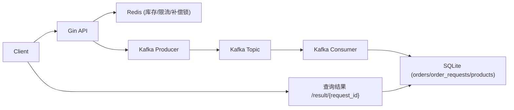

# Flash Sale Demo (面试导向)

这个项目是一个“能跑、能压测、能讲清楚”的秒杀最小实现，重点不是功能堆叠，而是把高并发核心原则落到代码里。

## 1. 目标与边界

- 目标：
  - 不超卖
  - 一人一单
  - 高并发入口快速返回
  - 异步链路可追踪、可补偿、可解释
- 边界：
  - 这是面试 demo，不是完整电商系统
  - 使用 SQLite + Redis + Kafka，强调原理与工程化思路

## 2. 架构总览



## 3. 核心链路（下单）

1. API 校验商品、时间窗、限购条件  
2. Redis Lua 原子扣减库存（防超卖）  
3. 落 `order_requests` 为 `pending`（请求状态可追踪）  
4. 发送 Kafka 消息（异步削峰）  
5. Consumer 消费后写 `orders`，并将 `order_requests` 置 `success`  
6. 如果消费失败且属于业务失败（如重复购买），将 `order_requests` 置 `failed` 并做库存补偿  
7. 客户端通过 `request_id` 轮询结果状态

## 4. 关键可靠性设计

### 4.1 防超卖
- 使用 Redis Lua 脚本完成“读库存 + 判断 + 扣减”的原子操作。

### 4.2 一人一单（双保险）
- 应用层快速检查：`pending/success` 请求直接拦截。  
- DB 强约束：`orders` 表 `(user_id, product_id)` 唯一索引兜底并发竞争。

### 4.3 请求状态机（可观测）
- `order_requests`：`pending/success/failed`  
- `/api/flash_sale/result/:request_id` 返回明确终态，不再“永远 pending”。

### 4.4 Kafka 可靠性语义
- Producer 显式 `RequiredAcks = RequireAll`，并配置重试/超时。  
- Consumer 改为 `FetchMessage -> 业务处理 -> CommitMessages`，只在处理成功后提交 offset。  
- 语义是 `at-least-once`，依赖幂等去重保证最终正确性。

### 4.5 幂等与补偿
- `orders.request_id` 唯一索引保证重复消息不重复建单。  
- 库存补偿使用 Redis `SETNX + INCRBY` Lua，按 `request_id` 保障“最多补一次”。

### 4.6 运维与治理
- 核心参数配置化（环境变量）。  
- 预热接口加 `X-Admin-Token`。  
- 服务支持优雅退出（信号处理 + HTTP shutdown + consumer cancel）。

## 5. 模块说明

- `cmd/server/main.go`  
  - 启动入口、配置加载、依赖初始化、优雅退出
- `internal/config/config.go`  
  - 环境变量配置解析
- `internal/router/router.go`  
  - HTTP 路由、下单主流程、请求结果查询
- `internal/middleware/ratelimit.go`  
  - Redis Lua 滑动窗口限流
- `internal/queue/producer.go`  
  - Kafka 生产端（ACK/重试/超时）
- `internal/queue/consumer.go`  
  - Kafka 消费端（手动 commit、幂等处理、失败补偿）
- `internal/model/*.go`  
  - `Product` / `Order` / `OrderRequest` 数据模型与约束
- `pkg/redis/keys.go`  
  - Redis key 规范
- `pkg/redis/stock_compensation.go`  
  - 幂等库存补偿脚本封装
- `cmd/loadtest/main.go`  
  - 并发压测脚本

## 6. 快速启动

### 6.1 启动依赖

```bash
docker compose up -d
```

### 6.2 启动服务

```bash
go run ./cmd/server
```

### 6.3 创建商品

```bash
curl -X POST http://localhost:8080/api/products \
  -H "Content-Type: application/json" \
  -d '{
    "name":"iphone flash",
    "stock":100,
    "sale_price":399900,
    "start_time":"2026-01-01T10:00:00Z",
    "end_time":"2027-01-01T10:00:00Z"
  }'
```

### 6.4 预热库存（管理员）

```bash
curl -X POST http://localhost:8080/api/flash_sale/preload/1 \
  -H "X-Admin-Token: dev-admin-token"
```

### 6.5 发起秒杀请求

```bash
curl -X POST http://localhost:8080/api/flash_sale/buy \
  -H "Content-Type: application/json" \
  -d '{"product_id":1,"user_id":10001,"quantity":1}'
```

### 6.6 查询结果

```bash
curl http://localhost:8080/api/flash_sale/result/<request_id>
```

### 6.7 压测

```bash
go run ./cmd/loadtest -product 1 -users 200 -c 50 -admin-token dev-admin-token
```

## 7. 关键环境变量

- `HTTP_ADDR` 默认 `:8080`
- `DB_PATH` 默认 `flash_sale.db`
- `REDIS_ADDR` 默认 `localhost:6379`
- `REDIS_DB` 默认 `0`
- `KAFKA_BROKERS` 默认 `localhost:9092`（逗号分隔）
- `KAFKA_TOPIC` 默认 `flash-sale-orders`
- `KAFKA_GROUP_ID` 默认 `flash-sale-order-consumer`
- `BUY_RATE_LIMIT` 默认 `1000`
- `BUY_RATE_WINDOW_SEC` 默认 `1`
- `STOCK_CACHE_TTL_HOUR` 默认 `24`
- `PRELOAD_ADMIN_TOKEN` 默认 `dev-admin-token`

## 8. 面试高频考题（建议背到“结构化表达”）

1. 为什么库存先扣 Redis，不直接扣数据库？  
2. Lua 脚本如何避免超卖？  
3. 一人一单如何保证？为什么“应用层检查”不够？  
4. Kafka 的 ACK 是什么？`acks=all` 解决什么问题？  
5. 为什么消费端要手动提交 offset，而不是自动提交？  
6. 这套方案是 exactly-once 吗？为什么是 at-least-once？  
7. 重复消费如何做到业务幂等？  
8. 消费失败如何补偿库存？如何保证不重复补偿？  
9. 为什么需要 `order_requests` 这张状态表？  
10. 客户端为什么要用 `request_id` 轮询？  
11. 如果 Kafka 宕机，下单接口如何表现？  
12. 如果 DB 宕机，如何避免“库存扣了但没订单”？  
13. 限流为何放在网关/接口层，粒度如何设计（用户/IP）？  
14. 为什么要配置化（地址、topic、限流）？  
15. 你如何证明方案有效（压测指标看什么）？  

## 9. 可以继续扩展的方向

- 失败消息转死信队列（DLQ）  
- 订单超时取消自动回补库存  
- 支付回调与订单状态机（待支付/已支付/已取消）  
- 指标与监控（QPS、消费 lag、失败率、补偿次数）  
- 从 SQLite 迁移到 MySQL/PostgreSQL 并使用更完整的事务隔离策略
