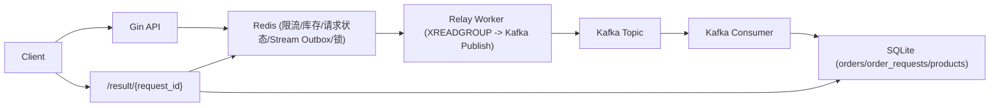

# Flash Sale Demo (面试导向)

这个项目是一个“能跑、能压测、能讲清楚”的秒杀最小实现。  
核心是把高并发入口、异步削峰、幂等与补偿这些原则落到代码里。

## 1. 目标与边界

- 目标：
  - 不超卖
  - 一人一单
  - 下单接口快速返回（不做同步落单）
  - 异步链路可追踪、可恢复、可解释
- 边界：
  - 这是面试 demo，不是完整电商系统
  - 使用 SQLite + Redis + Kafka，强调实现思路与工程权衡

## 2. 架构总览



## 3. 核心链路（下单）

1. API 校验商品、时间窗、数量参数  
2. Redis Lua 原子接入：
   - 幂等键命中直接返回历史 `request_id`
   - 一人一单锁检查
   - 库存校验与扣减
   - 写 `request_id -> pending`
   - `XADD` 写入 Redis Stream outbox
3. API 立即返回 `request_id + pending`
4. Relay 从 Stream 消费，发布 Kafka；成功才 `XACK`，失败不 ACK 重试
5. Consumer 消费 Kafka，事务落 `orders` 与 `order_requests`
6. Consumer 回写 Redis 请求状态（`success/failed`）
7. 客户端轮询 `/api/flash_sale/result/:request_id` 查询终态

## 4. 关键可靠性设计

### 4.1 防超卖
- 库存判断与扣减在 Redis Lua 内原子执行（单线程命令模型保证脚本原子）。

### 4.2 一人一单（多层约束）
- Redis 层：`userLockKey(product_id,user_id)` 前置拦截。  
- DB 层：`orders(user_id, product_id)` 唯一索引兜底并发竞争。  
- 幂等层：`request_id` 唯一索引防重复消息重复建单。

### 4.3 请求状态机（可观测）
- Redis 状态：`pending/success/failed`（短期热点查询）。  
- DB 状态：`order_requests`（持久化审计与排障）。  
- 查询接口：先 Redis，miss 再查 DB 并回填 Redis。

### 4.4 Unknown Outcome 收敛（核心改造点）
- API 不直接 Publish Kafka，避免“写入已成功但 ACK 丢失”的不确定窗口。  
- 先将事件原子写入 Redis Stream，再由 Relay 异步转 Kafka。  
- Relay 发布失败不 ACK，消息保留在 Stream/Pending 列表继续重试。

### 4.5 Kafka 可靠性语义
- Producer 使用 `RequiredAcks = RequireAll` + 重试/超时。  
- Consumer 使用手动提交：`Fetch -> 业务处理成功 -> Commit`。  
- 语义是 `at-least-once`，依赖幂等约束保证最终正确。

### 4.6 幂等与补偿
- `orders.request_id` 唯一索引保证重复消息幂等。  
- 重复购买（业务冲突）会标记失败并执行库存回补。  
- 库存回补使用 Redis `SETNX + INCRBY` Lua，保证同一 `request_id` 最多补一次。

### 4.7 缓存策略（状态读写）
- 写路径：Consumer 落库后主动更新 Redis 请求状态（加速轮询可见性）。  
- 读路径：`/result` Redis 优先，DB 兜底回填。  
- 一致性语义：最终一致，DB 为事实来源。

### 4.8 运维与治理
- 核心参数配置化（地址、Topic、限流阈值、Stream/Group）。  
- 预热接口需要 `X-Admin-Token`。  
- 服务优雅退出：停止 worker（relay/consumer）后再关闭 HTTP。

## 5. 模块说明

- `cmd/server/main.go`  
  - 启动入口、依赖初始化、Relay + Consumer 启动、优雅退出
- `internal/config/config.go`  
  - 环境变量解析（含 Redis Stream outbox 配置）
- `internal/router/router.go`  
  - HTTP 路由、秒杀入口、结果查询（Redis 优先 + DB 回查）
- `internal/middleware/ratelimit.go`  
  - Redis Lua 滑动窗口限流（user 优先，IP 退化）
- `internal/queue/relay.go`  
  - Redis Stream -> Kafka 转发（成功 ACK，失败重试）
- `internal/queue/producer.go`  
  - Kafka 生产封装（ACK/重试/超时）
- `internal/queue/consumer.go`  
  - Kafka 消费落库（手动 commit、事务、幂等、补偿）
- `internal/model/*.go`  
  - `Product` / `Order` / `OrderRequest` 数据模型与唯一约束
- `pkg/redis/keys.go`  
  - Redis key 命名规范
- `pkg/redis/request_state.go`  
  - Redis 请求状态读写封装
- `pkg/redis/user_lock.go`  
  - 用户锁安全释放（value 匹配 `request_id` 才删除）
- `pkg/redis/stock_compensation.go`  
  - 幂等库存回补脚本封装
- `cmd/loadtest/main.go`  
  - 并发压测脚本

## 6. 快速启动

### 6.1 启动依赖

```bash
docker compose up -d
```

### 6.2 启动服务

```bash
go run ./cmd/server
```

### 6.3 创建商品

```bash
curl -X POST http://localhost:8080/api/products \
  -H "Content-Type: application/json" \
  -d '{
    "name":"iphone flash",
    "stock":100,
    "sale_price":399900,
    "start_time":"2026-01-01T10:00:00Z",
    "end_time":"2027-01-01T10:00:00Z"
  }'
```

### 6.4 预热库存（管理员）

```bash
curl -X POST http://localhost:8080/api/flash_sale/preload/1 \
  -H "X-Admin-Token: dev-admin-token"
```

### 6.5 发起秒杀请求（建议带幂等键）

```bash
curl -X POST http://localhost:8080/api/flash_sale/buy \
  -H "Content-Type: application/json" \
  -H "X-Idempotency-Key: req-10001-1" \
  -d '{"product_id":1,"user_id":10001,"quantity":1}'
```

### 6.6 查询结果

```bash
curl http://localhost:8080/api/flash_sale/result/<request_id>
```

### 6.7 压测

```bash
go run ./cmd/loadtest -product 1 -users 200 -c 50 -admin-token dev-admin-token
```

## 7. 关键环境变量

- `HTTP_ADDR` 默认 `:8080`
- `DB_PATH` 默认 `flash_sale.db`
- `REDIS_ADDR` 默认 `localhost:6379`
- `REDIS_DB` 默认 `0`
- `KAFKA_BROKERS` 默认 `localhost:9092`（逗号分隔）
- `KAFKA_TOPIC` 默认 `flash-sale-orders`
- `KAFKA_GROUP_ID` 默认 `flash-sale-order-consumer`
- `ORDER_EVENT_STREAM` 默认 `flash_sale:order_events`
- `ORDER_EVENT_GROUP` 默认 `flash-sale-relay-group`
- `ORDER_EVENT_CONSUMER` 默认 `flash-sale-relay-1`
- `BUY_RATE_LIMIT` 默认 `1000`
- `BUY_RATE_WINDOW_SEC` 默认 `1`
- `STOCK_CACHE_TTL_HOUR` 默认 `24`
- `PRELOAD_ADMIN_TOKEN` 默认 `dev-admin-token`

## 8. 面试高频考题（结合本项目）

### 8.1 架构与链路

1. 问：为什么库存先扣 Redis，不直接扣数据库？  
   答：秒杀入口是热点写，DB 承压差。Redis Lua 原子扣减可实现高并发下快失败和不超卖，再异步落库。

2. 问：为什么引入 Redis Stream Relay，而不是 API 直接发 Kafka？  
   答：为了解决 publish 的 unknown outcome（可能已写入但 ACK 丢失）。API 先原子写 Stream outbox，Relay 再转 Kafka，失败不 ACK 可重试。

3. 问：客户端为什么拿 `request_id` 轮询？  
   答：下单接口只负责“受理并入队”，订单是异步创建，接口返回时不保证已有订单号。

4. 问：`request_id` 的作用是什么？  
   答：链路追踪 ID + 幂等主键。Kafka 消息、订单唯一索引、请求状态查询都围绕它。

### 8.2 一致性、幂等与补偿

5. 问：这套是 exactly-once 吗？  
   答：不是。Kafka 消费语义是 at-least-once，靠唯一约束和状态机实现幂等收敛。

6. 问：一人一单如何保证？  
   答：Redis 用户锁前置 + DB `(user_id, product_id)` 唯一索引兜底。

7. 问：重复消息如何处理？  
   答：命中 `orders.request_id` 唯一冲突时，消费端把请求状态同步为 success，不重复建单。

8. 问：消费失败如何补偿库存？  
   答：失败路径走 Redis Lua 回补，`SETNX` 抢补偿锁，保证同一请求最多回补一次。

9. 问：如果 Relay 发 Kafka 失败怎么办？  
   答：不 ACK Stream，消息会留在 pending/new 列表，后续重试，不做“立即失败补偿”。

10. 问：如果消费端“业务成功但 offset 提交失败”怎么办？  
    答：会重投同一消息，但由于幂等约束和终态收敛，不会产生重复订单。

### 8.3 限流与工程化

11. 问：限流为什么做在接口层，且 user/IP 双维度？  
    答：接口层能最早挡洪峰；优先 user 更公平，解析失败退化 IP 防绕过。

12. 问：为什么 Redis 限流失败时放行（fail-open）？  
    答：限流是保护能力，不应成为单点拒绝源。基础设施抖动时优先保持服务可用。

13. 问：状态缓存为什么不是纯 cache-aside（只删不更）？  
    答：结果查询是高频轮询场景，写后直更 Redis 能更快可见；同时保留 DB 回查兜底。

### 8.4 压测与观察

14. 问：如何验证不超卖和一人一单？  
    答：看成功单数不超库存、同用户不出现多笔成功单、库存与订单数可对账。

15. 问：重点监控哪些指标？  
    答：入口 QPS、429 比例、`pending/success/failed` 占比、Relay 重试、Kafka lag、补偿次数、500 错误率。

## 9. 可继续扩展方向

- Relay 增加 `XAUTOCLAIM` 接管僵尸 pending 消息  
- Stream/Kafka 的 DLQ 与重试上限策略  
- 订单超时取消自动回补库存  
- 支付状态机（待支付/已支付/已取消）  
- 指标与告警完善（lag、重试率、补偿率）  
- SQLite 迁移到 MySQL/PostgreSQL 并增强事务隔离策略
