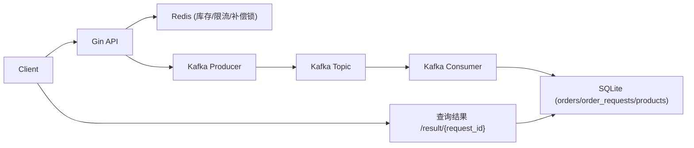

# Flash Sale Demo (面试导向)

这个项目是一个“能跑、能压测、能讲清楚”的秒杀最小实现，重点不是功能堆叠，而是把高并发核心原则落到代码里。

## 1. 目标与边界

- 目标：
  - 不超卖
  - 一人一单
  - 高并发入口快速返回
  - 异步链路可追踪、可补偿、可解释
- 边界：
  - 这是面试 demo，不是完整电商系统
  - 使用 SQLite + Redis + Kafka，强调原理与工程化思路

## 2. 架构总览



## 3. 核心链路（下单）

1. API 校验商品、时间窗、限购条件  
2. Redis Lua 原子扣减库存（防超卖）  
3. 落 `order_requests` 为 `pending`（请求状态可追踪）  
4. 发送 Kafka 消息（异步削峰）  
5. Consumer 消费后写 `orders`，并将 `order_requests` 置 `success`  
6. 如果消费失败且属于业务失败（如重复购买），将 `order_requests` 置 `failed` 并做库存补偿  
7. 客户端通过 `request_id` 轮询结果状态

## 4. 关键可靠性设计

### 4.1 防超卖
- 使用 Redis Lua 脚本完成“读库存 + 判断 + 扣减”的原子操作。

### 4.2 一人一单（双保险）
- 应用层快速检查：`pending/success` 请求直接拦截。  
- DB 强约束：`orders` 表 `(user_id, product_id)` 唯一索引兜底并发竞争。

### 4.3 请求状态机（可观测）
- `order_requests`：`pending/success/failed`  
- `/api/flash_sale/result/:request_id` 返回明确终态，不再“永远 pending”。

### 4.4 Kafka 可靠性语义
- Producer 显式 `RequiredAcks = RequireAll`，并配置重试/超时。  
- Consumer 改为 `FetchMessage -> 业务处理 -> CommitMessages`，只在处理成功后提交 offset。  
- 语义是 `at-least-once`，依赖幂等去重保证最终正确性。

### 4.5 幂等与补偿
- `orders.request_id` 唯一索引保证重复消息不重复建单。  
- 库存补偿使用 Redis `SETNX + INCRBY` Lua，按 `request_id` 保障“最多补一次”。

### 4.6 运维与治理
- 核心参数配置化（环境变量）。  
- 预热接口加 `X-Admin-Token`。  
- 服务支持优雅退出（信号处理 + HTTP shutdown + consumer cancel）。

## 5. 模块说明

- `cmd/server/main.go`  
  - 启动入口、配置加载、依赖初始化、优雅退出
- `internal/config/config.go`  
  - 环境变量配置解析
- `internal/router/router.go`  
  - HTTP 路由、下单主流程、请求结果查询
- `internal/middleware/ratelimit.go`  
  - Redis Lua 滑动窗口限流
- `internal/queue/producer.go`  
  - Kafka 生产端（ACK/重试/超时）
- `internal/queue/consumer.go`  
  - Kafka 消费端（手动 commit、幂等处理、失败补偿）
- `internal/model/*.go`  
  - `Product` / `Order` / `OrderRequest` 数据模型与约束
- `pkg/redis/keys.go`  
  - Redis key 规范
- `pkg/redis/stock_compensation.go`  
  - 幂等库存补偿脚本封装
- `cmd/loadtest/main.go`  
  - 并发压测脚本

## 6. 快速启动

### 6.1 启动依赖

```bash
docker compose up -d
```

### 6.2 启动服务

```bash
go run ./cmd/server
```

### 6.3 创建商品

```bash
curl -X POST http://localhost:8080/api/products \
  -H "Content-Type: application/json" \
  -d '{
    "name":"iphone flash",
    "stock":100,
    "sale_price":399900,
    "start_time":"2026-01-01T10:00:00Z",
    "end_time":"2027-01-01T10:00:00Z"
  }'
```

### 6.4 预热库存（管理员）

```bash
curl -X POST http://localhost:8080/api/flash_sale/preload/1 \
  -H "X-Admin-Token: dev-admin-token"
```

### 6.5 发起秒杀请求

```bash
curl -X POST http://localhost:8080/api/flash_sale/buy \
  -H "Content-Type: application/json" \
  -d '{"product_id":1,"user_id":10001,"quantity":1}'
```

### 6.6 查询结果

```bash
curl http://localhost:8080/api/flash_sale/result/<request_id>
```

### 6.7 压测

```bash
go run ./cmd/loadtest -product 1 -users 200 -c 50 -admin-token dev-admin-token
```

## 7. 关键环境变量

- `HTTP_ADDR` 默认 `:8080`
- `DB_PATH` 默认 `flash_sale.db`
- `REDIS_ADDR` 默认 `localhost:6379`
- `REDIS_DB` 默认 `0`
- `KAFKA_BROKERS` 默认 `localhost:9092`（逗号分隔）
- `KAFKA_TOPIC` 默认 `flash-sale-orders`
- `KAFKA_GROUP_ID` 默认 `flash-sale-order-consumer`
- `BUY_RATE_LIMIT` 默认 `1000`
- `BUY_RATE_WINDOW_SEC` 默认 `1`
- `STOCK_CACHE_TTL_HOUR` 默认 `24`
- `PRELOAD_ADMIN_TOKEN` 默认 `dev-admin-token`

## 8. 面试高频考题（结合本项目，附可复述答案）

### 8.1 架构与链路

1. 问：为什么库存先扣 Redis，不直接扣数据库？  
   答：秒杀流量是突发高并发，数据库不适合做热点扣减第一入口。这个项目先在 Redis 用 Lua 原子扣减，保证高并发下“快失败 + 不超卖”，再异步落库，把数据库压力从“实时扣减”变成“顺序消费建单”。

2. 问：为什么要引入 Kafka，不同步写订单？  
   答：核心是削峰填谷。接口线程只做校验、扣库存、写请求状态、投递消息，快速返回 `pending`；真正建单放到消费端，避免请求线程被 DB 写入和事务阻塞拖慢。

3. 问：为什么要有 `order_requests` 这张表？  
   答：它是异步链路的状态机，记录 `pending/success/failed`，解决两件事：第一，客户端可查询最终结果；第二，失败可追踪可排障，不会出现“请求发了但系统说不清状态”。

4. 问：客户端为什么用 `request_id` 轮询结果，而不是下单接口直接返回订单号？  
   答：因为本项目是异步建单。下单接口返回时订单可能还没创建，所以先返回 `request_id` + `pending`，客户端再查 `/result/{request_id}` 获取终态。

5. 问：`request_id` 在系统里除了“查询”还有什么作用？  
   答：它还是幂等主键和链路追踪 ID。Kafka 消息带 `request_id`，`orders.request_id` 唯一约束防重复建单，日志和排障也可以沿这个 ID 串起整条链路。

### 8.2 一致性、幂等与补偿

6. 问：Lua 脚本如何避免超卖？  
   答：脚本把“读库存、判断是否足够、扣减库存”放到 Redis 单线程执行的一个原子操作里，避免并发读到同一库存后重复扣减。

7. 问：一人一单怎么保证？为什么应用层检查不够？  
   答：项目做了双保险。应用层先查 `order_requests` 的 `pending/success` 做快速拦截；数据库层再用 `orders(user_id, product_id)` 唯一索引做最终兜底。只做应用层会被并发穿透。

8. 问：这套语义是 exactly-once 吗？  
   答：不是，是 at-least-once。消费端只有业务成功才提交 offset，失败不提交会重投，所以消息可能重复；但通过唯一索引和状态机把重复消费收敛成幂等结果。

9. 问：为什么消费端要手动提交 offset，不用自动提交？  
   答：自动提交会有“先提交、后失败”的风险，消息就丢处理了。手动提交是 `Fetch -> 处理成功 -> Commit`，即使进程中途挂掉也会重投，可靠性更高。

10. 问：消费端如何处理重复消息？  
    答：先查 `order_requests`，如果已是 `success/failed` 直接跳过；建单时如果命中 `orders.request_id` 唯一冲突，就把请求状态同步成 `success`，保证重复消息不重复建单。

11. 问：消费失败如何补偿库存？如何保证不重复补偿？  
    答：失败路径会调用 Redis Lua 回补脚本，先 `SETNX compensation_lock:{request_id}` 抢补偿锁，抢到才 `INCRBY` 回库存，确保同一请求最多补一次。

12. 问：如果“Redis 扣库存成功，但写 `order_requests` 失败”怎么办？  
    答：API 在 `db.Create(order_requests)` 失败时会立即执行幂等回补，并返回 500，避免出现“库存扣了但请求状态不存在”的脏状态。

13. 问：如果 Kafka 发送失败，下单请求怎么处理？  
    答：会把该 `request_id` 状态改成 `failed(enqueue_failed)`，然后执行库存回补并返回 500。也就是失败可见、库存可回滚。

14. 问：如果消费端“业务成功但提交 offset 失败”会怎样？  
    答：Kafka 会重投同一消息，但由于订单唯一索引和请求状态机已落终态，重投只会命中幂等分支，不会造成重复订单。

15. 问：为什么消费端事务里要对 `order_requests` 做 `FOR UPDATE` 风格加锁？  
    答：是为了降低并发消费者竞态风险，确保同一个 `request_id` 的状态迁移和建单操作串行化，避免极端情况下的状态覆盖。

16. 问：如果消费者拿到消息但找不到对应 `order_requests` 记录怎么办？  
    答：实现里会补一条 `failed(request_state_missing)` 记录，然后做一次库存回补。这样可以把“理论不该发生”的异常转成可观测、可恢复状态。

### 8.3 限流、可运维与工程化

17. 问：限流为什么放在接口层？为什么要有 user/IP 两级？  
    答：接口层能最早挡掉洪峰，降低后端资源消耗。优先按 `user_id` 限流更贴业务公平性；解析失败退化到 IP 限流，防恶意流量绕过。

18. 问：为什么 Redis 限流失败时选择放行，而不是直接拒绝？  
    答：这是可用性优先策略。限流属于保护能力，不应成为单点故障；Redis 抖动时若全部拒绝会放大故障面，所以当前实现选择 fail-open。

19. 问：为什么示例里限制 `quantity=1`？  
    答：这是为了聚焦“一人一单、库存一致性、异步可靠性”这些核心问题，先把模型简化。多件购买会引入配额拆分和更复杂的并发校验，可作为后续扩展。

20. 问：预热接口为什么要管理员 token？库存 key 为什么要 TTL？  
    答：token 防止被任意调用导致库存被重置；TTL 防止脏 key 永久残留，便于环境重启或活动切换后的自动清理。

21. 问：为什么强调配置化（地址、Topic、限流阈值）？  
    答：同一套二进制在不同环境参数不同，配置化能避免硬编码带来的发布风险，也方便压测时快速调参验证系统行为。

22. 问：优雅退出做了什么，为什么重要？  
    答：收到信号后先停止消费者拉新消息，再执行 HTTP shutdown，避免进程硬退出导致请求中断或消费状态不一致，提升可运维性。

### 8.4 压测与结果解释

23. 问：你如何证明“不超卖”和“一人一单”真的生效？  
    答：压测时看三类结果：`200` 成功数不超过库存、同一用户不会出现多个成功订单、最终 Redis 库存不为负且与订单数对得上。

24. 问：压测里出现大量 400 是 bug 吗？  
    答：不一定。这个项目里 `400` 可能是库存不足或重复购买被拦截，属于预期保护行为。关键是看是否出现超卖、重复建单和异常 500 峰值。

25. 问：你会重点监控哪些指标？  
    答：入口 QPS、429 比例、下单成功率、`order_requests` 各状态占比、Kafka 消费 lag、补偿次数、500 错误率。这些能直接反映系统是否在“正确地退化”。

26. 问：如果让你继续演进这套方案，优先做什么？  
    答：优先级通常是：DLQ（失败消息隔离）-> 订单超时取消回补 -> 完整支付状态机 -> 监控告警完善 -> SQLite 迁移到 MySQL/PostgreSQL 并补充更严格事务策略。

## 9. 可以继续扩展的方向

- 失败消息转死信队列（DLQ）  
- 订单超时取消自动回补库存  
- 支付回调与订单状态机（待支付/已支付/已取消）  
- 指标与监控（QPS、消费 lag、失败率、补偿次数）  
- 从 SQLite 迁移到 MySQL/PostgreSQL 并使用更完整的事务隔离策略
